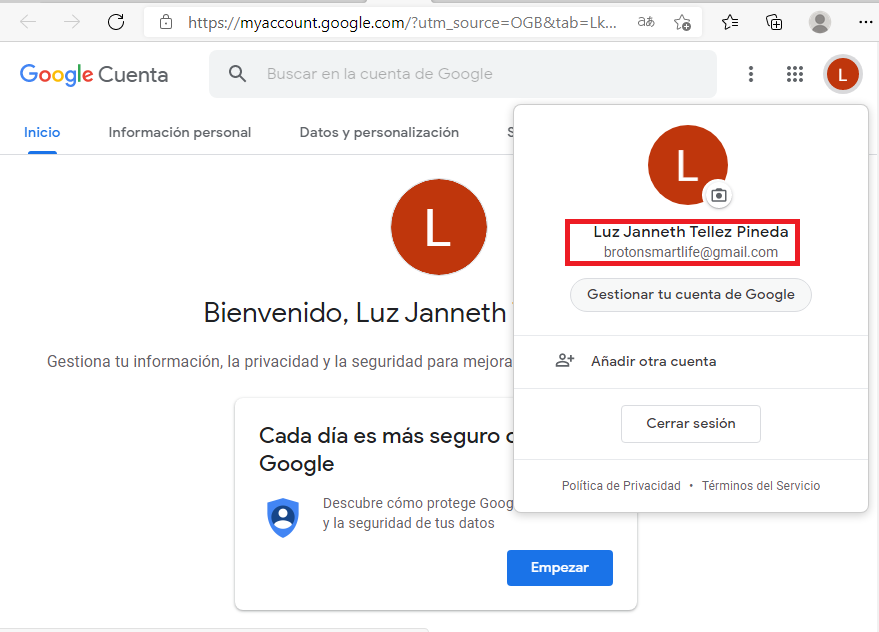
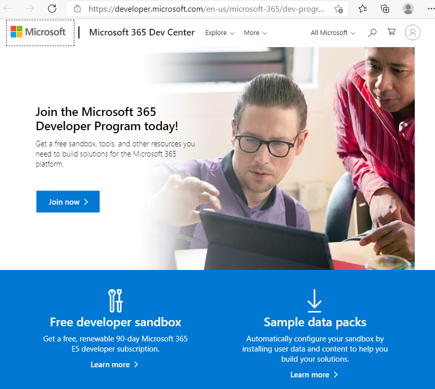
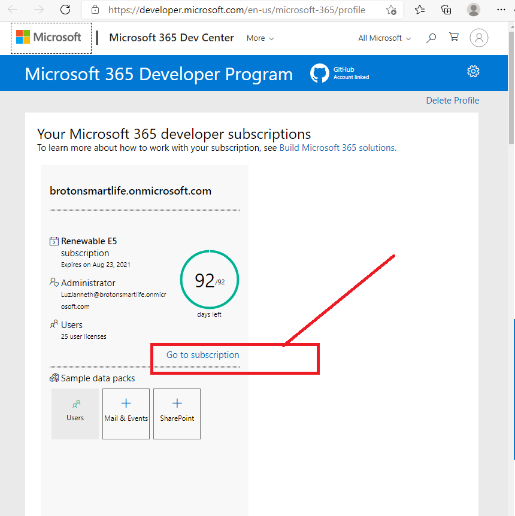

# Microsoft 365 Developer Program

1 - Crear una cuenta de empresa en google o en hotmail.

​	 BrotonSmartLife@gmail.com

 2 - Darse de alta en el programa de Desarrollador de Microsoft 365 (Con la cuenta anterior)

​	

​	[Developer Program - Microsoft 365](https://developer.microsoft.com/en-us/microsoft-365/dev-program)

3 - Crear con la cuenta de empresa el perfil en el Programa de desarrollador

​	[Dashboard - Microsoft 365 Dev Center](https://developer.microsoft.com/en-us/microsoft-365/profile)

​	Usuario: LuzJanneth@brotonsmartlife.onmicrosoft.com

4 - Seguir las instrucciones de los laboratorios en un entorno limpio y listo para iniciar con el aprendizaje de Power Platform y de Desarrollo de Microsoft 365

